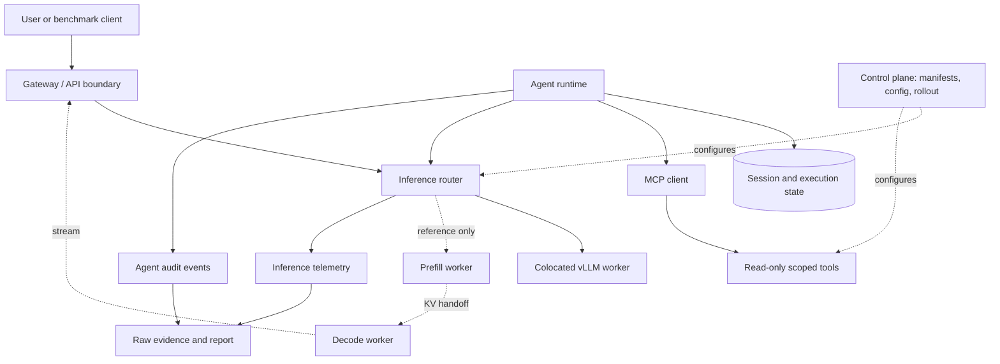

# Architecture

## Purpose

The labs evolve from a single inference process to an integrated inference and
operations system. This document separates responsibilities so that an
observability, agent or deployment failure does not get mislabeled as a model
or latency result.

The dashed P/D branch is a reference path until it runs on a compatible
two-GPU environment with connector evidence. It is not part of the measured
local performance path.

## Responsibility boundaries

| Plane | Owns | Must not do on the hot path |
| --- | --- | --- |
| Inference data plane | request validation, routing, streaming, model response | query a database, fetch arbitrary files or block on reporting |
| KV/P-D plane | prefill/decode handoff, cache/transfer instrumentation | assume transfer cost is zero or hide connector failure |
| Control plane | manifests, workload config, deployment revision, rollback | serve user tokens or decide agent authorization |
| Agent plane | task lifecycle, state, allowlisted tool decisions | become an authority for Kubernetes or arbitrary commands |
| MCP tool plane | bounded read-only observations | shell, `kubectl exec`, Secret reads or arbitrary filesystem access |
| Evidence plane | raw records, reports, run metadata | rewrite missing measurements into estimates |

## Interfaces

### Inference API

The request is OpenAI-compatible where supported. Each client request should
carry a request ID. The router records the selected route and returns only the
phase timings it can observe; connector-level transfer timing remains `NA`
unless exported by the connector.

### Agent/MCP API

The agent persists business state outside the context window. Its MCP tools are
read-only and schema-bounded. A valid identity does not automatically grant all
tools; authorization must be evaluated per scope.

### Kubernetes API

Kubernetes manifests are part of the control plane. The lab ServiceAccount has
only the verbs required for its observer role. A manifest parses successfully
without proving that a cluster accepted or ran it.

## Failure semantics

| Condition | Required response | What to record |
| --- | --- | --- |
| colocated worker unavailable | return a clear upstream failure; do not invent a response | request ID, status, timeout, backend state |
| P/D transfer/cache unavailable | recompute or use colocated fallback only if configured; mark degradation | selected path, fallback, timing, cache/transfer state |
| MCP unavailable | fail closed for the tool-dependent action; report evidence unavailable | task ID, tool ID, error type, state checkpoint |
| invalid config/manifest | reject before rollout and retain last-known-good config | config revision and validation error |
| a metric is absent | return `NA` | metric name and reason |

## Lifecycle invariants

- A run records its immutable model/config/workload identity before the first
  measured request.
- A request is served by one declared route: colocated or P/D reference/fallback.
- A task checkpoint survives a tool failure; transient context does not replace
  durable state.
- A tool cannot widen its own authority through model output.
- A configuration change is reversible through a named previous revision or a
  documented stop procedure.
