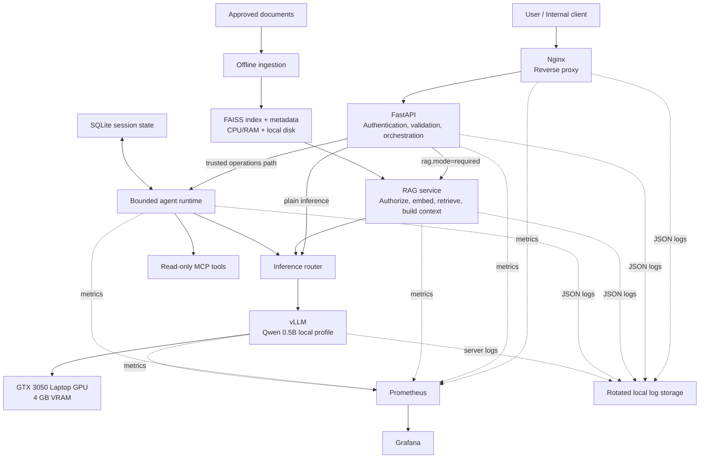

# Kiến trúc chuẩn — Single-Node LLM + RAG Operations Copilot

## 1. Scope và quyết định

Final Lab là hệ thống **single-node, production-style**: có boundary,
contract, observability và failure handling rõ ràng, nhưng không tuyên bố
high availability, autoscaling, multi-node capacity hay P/D performance. P/D
multi-GPU belongs to the optional [Advanced Track](../ADVANCED_TRACK.md), not
the core Final Lab runtime.

Ba loại yêu cầu không được lẫn với nhau:

| Request | Primary path | Terminal result |
|---|---|---|
| Plain inference | FastAPI -> router -> vLLM | model response + inference telemetry |
| Grounded answer | FastAPI -> RAG -> router -> vLLM | cited response hoặc `insufficient_evidence` |
| Operations | FastAPI -> bounded agent -> MCP read-only | audited observation hoặc `failed_closed` |

RAG chỉ chạy khi `rag.mode=required`. Thiếu evidence không được fallback âm thầm
sang plain inference.

## 2. System context



Prometheus giữ telemetry số; log có cấu trúc là stream khác. Grafana đọc
Prometheus, không thay thế log storage hoặc audit events.

## 3. Component ownership

| Boundary | Chịu trách nhiệm | Không được làm |
|---|---|---|
| Nginx | reverse proxy; TLS/rate-limit policy khi được cấu hình | quyết định quyền tài liệu/tool |
| FastAPI | authentication, contract validation, correlation, chọn path | bypass policy hoặc log raw sensitive data |
| RAG | access scope, CPU embedding, retrieval, cited context | trả lời grounded khi thiếu authorized evidence |
| Router | colocated request ID, route và timeout policy | kích hoạt hoặc gọi Advanced P/D là core success |
| vLLM | generation và runtime metrics | dùng GPU cho embedding/index mặc định |
| Agent | durable state, one bounded decision, audit/idempotency | tự cấp quyền hoặc thực thi action nguy hiểm |
| MCP | schema-validated read-only observations | shell, secret read, filesystem/deployment write |
| Observability | metrics, logs, run evidence | log prompt/document/token/secret |

## 4. Online request flows

### Plain inference

```text
Client -> Nginx -> FastAPI validates/authenticates
       -> router selects colocated path
       -> vLLM/GPU
       -> response + safe metadata + terminal telemetry
```

### Grounded RAG answer

```text
Client with rag.mode=required
  -> FastAPI enforces knowledge-base scope
  -> RAG creates retrieval_id and CPU query embedding
  -> FAISS retrieves only authorized chunks
  -> context builder attaches source identifiers and index version
  -> router -> vLLM
  -> cited answer

No authorized chunk or unavailable index
  -> insufficient_evidence
```

### Operational agent path

Agent không chạy cho mọi chat request. Nó chỉ được chọn từ trusted operations
endpoint/policy, load SQLite state, đưa ra một quyết định có giới hạn, gọi tối
đa MCP tool nằm trong allowlist, ghi audit event, rồi mới có thể dùng vLLM để
trình bày observation. Timeout hoặc denial luôn là `failed_closed`.

## 5. Data plane và storage

### Offline ingestion

```text
approved source
  -> provenance + checksum + access scope
  -> normalize / chunk
  -> CPU embedding
  -> FAISS index + metadata
  -> index manifest
```

Mỗi chunk giữ `document_id`, `chunk_id`, source locator, access scope,
chunking version, embedding-model version và index version. Xoá tài liệu, đổi
quyền, đổi chunking hoặc embedding model là invalidation event.

| Data | Store | Control |
|---|---|---|
| source corpus | local read-only directory | không commit dữ liệu nhạy cảm |
| FAISS + metadata | versioned local disk | rebuild/invalidate theo manifest |
| agent state/audit | SQLite | context window không phải durable state |
| metrics/logs | local disk with retention | redaction và retention trước evidence claim |
| benchmark evidence | `results/<run>/` | metadata manifest + sanitized artifacts |

## 6. Security, failure và correlation

Authentication diễn ra tại FastAPI trước khi caller dùng model, knowledge base
hoặc operations path. Authorization cho RAG phải chọn authorized namespace hoặc
index partition **trước** khi context được tạo; post-filtering sau retrieval
không đủ để bảo vệ access scope.

| Failure | Bắt buộc trả về | Không được làm |
|---|---|---|
| vLLM/router unavailable | bounded serving error + correlation IDs | fabricated completion/latency |
| index unavailable | `insufficient_evidence` for required RAG | plain LLM fallback |
| no authorized chunks | grounded abstention | invented citation/broader scope |
| MCP timeout/denial | `failed_closed` | retry qua shell/write tool |
| observability unavailable | telemetry marked unavailable | claim monitoring evidence exists |

Correlation graph:

```text
task_id
  ├-> retrieval_id (when RAG is used)
  ├-> llm_request_id -> router_request_id
  └-> tool_call_id (when MCP is used)
```

## 7. Hardware allocation and evaluation

| Resource | Default role | Constraint |
|---|---|---|
| GPU VRAM | vLLM small-model colocated inference | 2048 context, one sequence, 0.72 utilization profile |
| CPU | Nginx, FastAPI, RAG embedding/retrieval, Agent/MCP, observability | no CPU/RAM capacity claim yet |
| disk/RAM | FAISS, SQLite, metrics/logs, evidence | retention and index size need measurement |

Embedding model, chunk size và reranker chưa được chọn vì corpus language,
license, size và labeled evaluation set chưa tồn tại. Chọn chúng bây giờ sẽ là
assumption, không phải evidence-backed design.

Inference đánh giá TTFT, TPOT/ITL, E2E, queue time, errors và GPU/KV telemetry
khi runtime có source. RAG đánh giá riêng Recall@k, MRR/nDCG, context precision,
faithfulness, citation coverage/correctness, abstention, access-scope leakage,
freshness, retrieval latency và E2E latency.

## 8. Delivery gates

1. Contracts/static: API, RAG, metric, logging và error contract parse/link.
2. Plain serving: vLLM local readiness, streaming và raw inference evidence.
3. RAG: fixture corpus, CPU index, authorized retrieval, cited answer và
   insufficient-evidence test.
4. Agent: read-only MCP success/denial/timeout và session restart evidence.
5. Observability: enabled targets emit expected metrics/log fields; availability
   is measured, not assumed.
6. Failure: declared scenarios return the bounded terminal state.

Hiện repository mới hoàn thành scaffold/static design. Runtime, knowledge base,
index, monitoring và benchmark gate đều `NOT_RUN`.
