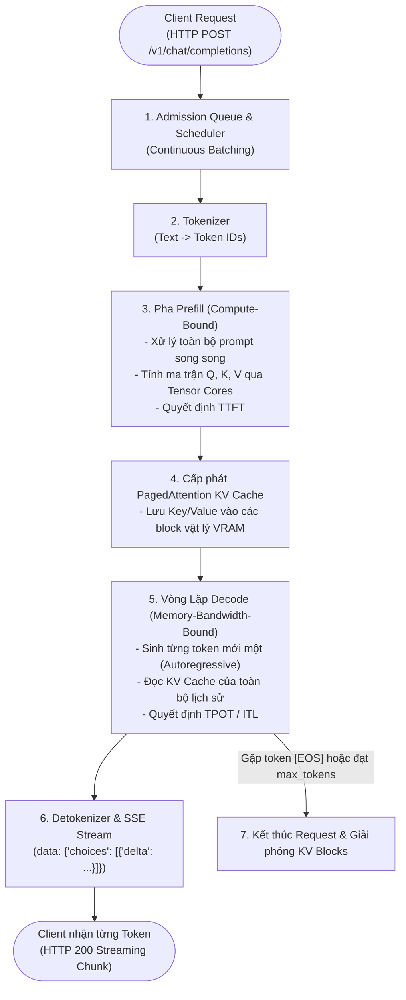
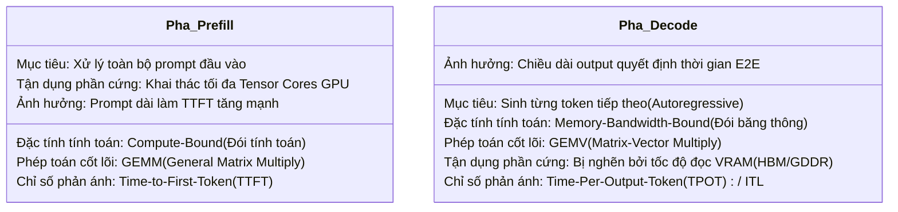
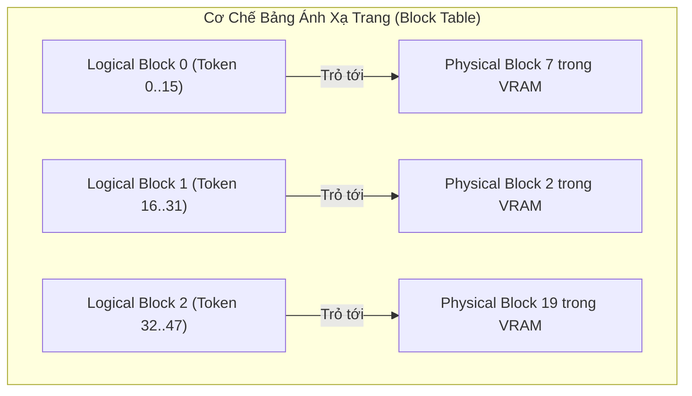
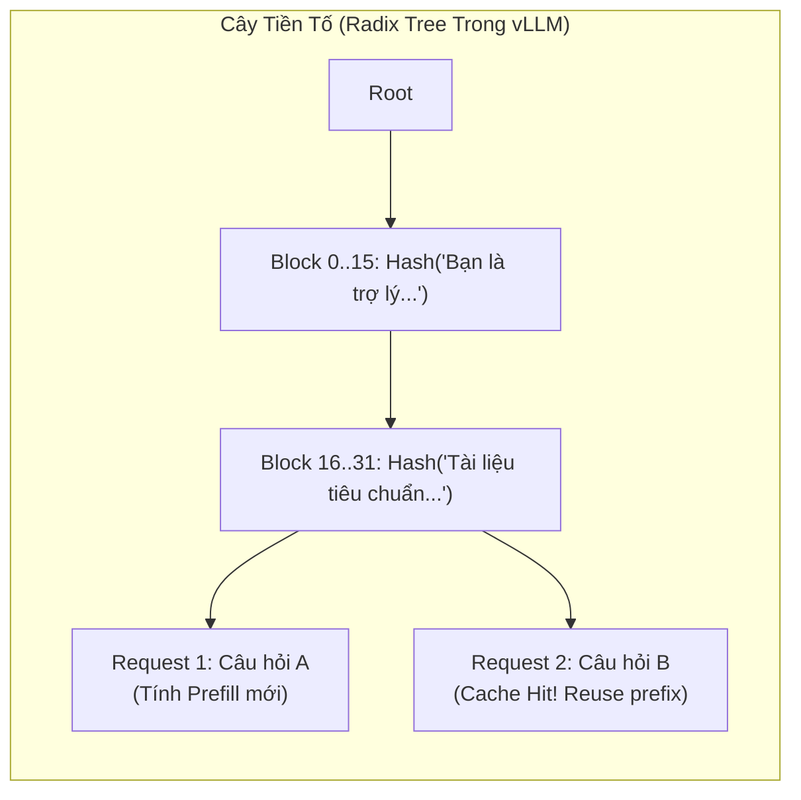

# LAB 01 — LLM Serving với vLLM: Prefill, Decode, KV Cache và Inference Optimization

**Cấp độ:** Beginner → Lower Intermediate  
**Thời lượng ước tính:** 3.5 – 4.5 giờ  
**Inference Engine:** [vLLM](https://github.com/vllm-project/vllm) Docker image `vllm/vllm-openai:v0.8.3`  
**Mục tiêu cốt lõi:** Không chỉ dừng lại ở việc "khởi động thành công model", lab này trang bị cho bạn năng lực của một Senior LLM Infrastructure Engineer: **đo lường, định lượng tài nguyên, benchmark đa chiều, phân tích nghẽn cổ chai (bottleneck) và đưa ra quyết định kiến trúc dựa trên dữ liệu thực nghiệm.**

---

## 📑 Mục Lục

1. [Mục Tiêu Học Tập & Năng Lực Đầu Ra](#1-mục-tiêu-học-tập--năng-lực-đầu-ra)
2. [Cấu Trúc Thư Mục Lab](#2-cấu-trúc-thư-mục-lab)
3. [Môi Trường Thực Nghiệm & Version Pinning](#3-môi-trường-thực-nghiệm--version-pinning)
4. [Kiến Thức Nền Tảng Chuyên Sâu](#4-kiến-thức-nền-tảng-chuyên-sâu)
   - 4.1 Pipeline Suy Luận & Vòng Đời Request
   - 4.2 Bản Chất Hai Pha: Prefill (Compute-Bound) vs Decode (Memory-Bound)
   - 4.3 Định Lượng Bộ Nhớ KV Cache & Thuật Toán PagedAttention
   - 4.4 Continuous Batching vs Static Batching
   - 4.5 Automatic Prefix Caching (APC)
   - 4.6 Hệ Thống Chỉ Số Đo Lường (Metrics) & Tiêu Chuẩn SLO / Goodput
5. [Quy Trình Thực Hành 13 Bước](#5-quy-trình-thực-hành-13-bước)
   - Bước 1: Kiểm tra GPU và môi trường Pre-flight
   - Bước 2: Khởi động vLLM Baseline Server (Prefix Cache: OFF)
   - Bước 3: Kiểm tra API OpenAI-Compatible & Streaming SSE
   - Bước 4: Khảo sát Prometheus Metrics (`/metrics`)
   - Bước 5: Benchmark Streaming Tuần Tự (Baseline Latency)
   - Bước 6: Concurrency Sweep (profile RTX 3050 4GB: 1, 2, 4)
   - Bước 7: Thực nghiệm A/B Automatic Prefix Caching
   - Bước 8: Trực quan hóa dữ liệu & Sinh đồ thị
   - Bước 9: Prompt Length vs TTFT
   - Bước 10: Thực nghiệm Áp Lực Bộ Nhớ (Memory Pressure & Preemption)
   - Bước 11: Thử nghiệm CPU Weight Offload (Tùy chọn phần cứng)
   - Bước 12: Mở rộng Quantization (FP16 vs AWQ/GPTQ/FP8)
   - Bước 13: Thử nghiệm Khả Năng Phục Hồi Khi Gặp Sự Cố (Resilience / Chaos)
6. [Bảng Đánh Đổi Kiến Trúc (Production Trade-off Matrix)](#6-bảng-đánh-đổi-kiến-trúc-production-trade-off-matrix)
7. [Cẩm Nang Xử Lý Sự Cố (Troubleshooting Guide)](#7-cẩm-nang-xử-lý-sự-cố-troubleshooting-guide)
8. [Tiêu Chí Chấm Điểm (Rubric 100 Điểm)](#8-tiêu-chí-chấm-điểm-rubric-100-điểm)
9. [Dọn Dẹp Môi Trường (Cleanup)](#9-dọn-dẹp-môi-trường-cleanup)
10. [Những Kết Luận Sai Lầm Phổ Biến (Anti-Conclusions)](#10-những-kết-luận-sai-lầm-phổ-biến-anti-conclusions)

---

## 1. Mục Tiêu Học Tập & Năng Lực Đầu Ra

Sau khi hoàn thành bài lab này, học viên có khả năng:

1. **Vận hành Production Serving:** Triển khai một OpenAI-compatible LLM server chuẩn production sử dụng Docker và vLLM với các tham số tối ưu hóa VRAM.
2. **Làm chủ Giao thức Streaming:** Gửi request non-streaming và streaming (Server-Sent Events), bóc tách từng token chunk ở phía client.
3. **Phân tích Vòng Đời Request:** Nhận diện và phân tách rành mạch hai pha **Prefill** và **Decode** trên phần cứng GPU.
4. **Đo Lường Chuẩn Kỹ Thuật:** Đo **TTFT**, **E2E Latency**, **Approximate TPOT**; chỉ gọi throughput theo token là hợp lệ khi có `api_usage` hoặc `tokenizer_estimate`, nếu không phải ghi `NA`.
5. **Tính Toán Định Lượng KV Cache:** Áp dụng công thức tính toán dung lượng VRAM mà KV Cache tiêu thụ cho các kiến trúc Attention (MHA, GQA, MQA).
6. **Làm Chủ Thuật Toán Caching:** Hiểu sâu thuật toán PagedAttention và thực nghiệm so sánh A/B tính năng **Automatic Prefix Caching (APC)**.
7. **Hiểu Sâu Continuous Batching:** Quan sát hiện tượng bão hòa tài nguyên và sự đánh đổi (trade-off) giữa **Throughput** và **P95/P99 Tail Latency** khi tăng concurrency.
8. **Đánh Giá SLO & Goodput:** Phân biệt giữa Throughput thô (Raw Throughput) và Goodput (Throughput đạt chuẩn Service Level Objective).
9. **Lập Luận Dựa Trên Dữ Liệu:** Viết báo cáo kỹ thuật theo mô hình nguyên nhân – hệ quả: `Configuration change → observed metric change → likely mechanism → trade-off → recommendation`.

---

## 2. Cấu Trúc Thư Mục Lab

```text
lab01-vllm-inference/
├── README.md                          ← Tài liệu hướng dẫn lab chính (file này)
├── requirements.txt                   ← Thư viện Python với version pinning
├── scripts/
│   ├── check_gpu.sh                   ← Kiểm tra GPU, Driver, Docker và VRAM
│   ├── start_vllm.sh                  ← Khởi động vLLM Baseline (Prefix Cache: OFF)
│   ├── start_vllm_prefix_cache.sh     ← Khởi động vLLM với Automatic Prefix Caching (ON)
│   ├── start_vllm_offload.sh          ← Khởi động vLLM với CPU Weight Offload
│   ├── stop_server.sh                 ← Dừng an toàn và giải phóng container
│   ├── collect_metrics.sh             ← Thu thập snapshot các chỉ số Prometheus (/metrics)
│   └── collect_run_metadata.sh        ← Gom version, image ID, API, metrics và server log
├── benchmark/
│   ├── benchmark_streaming.py         ← Benchmark streaming tuần tự đo TTFT, TPOT, E2E
│   ├── benchmark_concurrency.py       ← Concurrency sweep đa luồng (profile: 1, 2, 4)
│   ├── benchmark_prefix_cache.py      ← Thực nghiệm so sánh A/B Prefix Caching
│   ├── benchmark_prompt_length.py     ← Đo prompt length vs TTFT
│   ├── benchmark_common.py            ← Parser SSE và token metric dùng chung
│   └── analyze_results.py             ← Vẽ 8 đồ thị phân tích và xuất bảng Markdown
├── datasets/
│   ├── normal_prompts.jsonl           ← 50 prompt đa dạng chủ đề (tập Control)
│   └── shared_prefix_prompts.jsonl    ← 50 prompt có chung tài liệu hệ thống dài (tập Shared)
├── results/
│   ├── .gitkeep                       ← Thư mục lưu trữ CSV, JSON và đồ thị PNG
│   └── charts/                        ← Nơi chứa biểu đồ do analyze_results.py sinh ra
└── report/
    └── lab_report_template.md         ← Mẫu báo cáo thực nghiệm chuẩn để nộp bài

Ngoài ra, `VERSIONS.md` và `ENVIRONMENT.md` là hợp đồng version/phần cứng của Lab 01.
```

---

## 3. Môi Trường Thực Nghiệm & Version Pinning

Để đảm bảo tính tái lập (Reproducibility), toàn bộ công cụ và thư viện được quy định phiên bản rõ ràng:

| Thành phần | Phiên bản khuyến nghị | Kiểm tra tính tương thích | Ghi chú kỹ thuật |
|---|---|---|---|
| **OS** | Ubuntu 22.04 LTS / Linux x86_64 | `uname -a` | Môi trường tiêu chuẩn cho GPU serving |
| **NVIDIA Driver** | ≥ 535.xx (khuyên dùng 550.xx+) | `nvidia-smi` | Hỗ trợ CUDA 12.x |
| **CUDA Toolkit** | 12.1 – 12.6 | `nvcc --version` | Đi kèm sẵn trong vLLM Docker |
| **Docker** | ≥ 24.0 | `docker --version` | Hỗ trợ compose v2 và CDI |
| **NVIDIA Container Toolkit** | Mới nhất | `docker run --gpus all ...` | Cho phép container truy cập GPU |
| **vLLM Docker Image** | `vllm/vllm-openai:v0.8.3` | Docker Hub | Đã pin version, không dùng `:latest` |
| **Python Client** | ≥ 3.10 | `python3 --version` | Cần thiết cho type hints mới |
| **httpx** | ≥ 0.27.0 | `pip show httpx` | Hỗ trợ async streaming SSE |

### Thiết lập biến môi trường chuẩn cho RTX 3050 4GB

Chạy lệnh sau trên terminal của máy chủ thực hành:

```bash
# Chọn mô hình đã được kiểm thử phù hợp với VRAM máy bạn.
# GPU 16GB-24GB VRAM: có thể thử model 7B FP16/BF16.
# GPU 8GB-12GB VRAM : model nhỏ hơn hoặc quantized.
# GPU 4GB-6GB VRAM  : dùng model rất nhỏ hoặc quantized; profile mặc định bên dưới là 0.5B.
export MODEL_ID="Qwen/Qwen2.5-0.5B-Instruct"
export PORT=8000
export MAX_MODEL_LEN=4096
export GPU_MEMORY_UTILIZATION=0.80

# Nếu log báo OOM, hạ MAX_MODEL_LEN xuống 2048 trước khi giảm thêm model.
# Profile này dùng model 0.5B; không áp dụng nguyên xi cho model 1.5B/3B.

# Nếu model yêu cầu gated access:
export HF_TOKEN="hf_your_huggingface_token_here"

# Chỉ bật khi model đã được review và thật sự cần custom code:
# export TRUST_REMOTE_CODE=1

# Thư mục lưu cache mô hình trên host để tránh tải lại nhiều lần
export HF_HOME="${HOME}/.cache/huggingface"
mkdir -p "${HF_HOME}"

# Cài đặt các thư viện Python cho Client Benchmark
pip install -r requirements.txt
```

---

## 4. Kiến Thức Nền Tảng Chuyên Sâu

### 4.1 Pipeline Suy Luận & Vòng Đời Request

Khi một client gửi câu hỏi đến inference server, request phải đi qua một pipeline gồm nhiều công đoạn tuần tự:



---

### 4.2 Bản Chất Hai Pha: Prefill (Compute-Bound) vs Decode (Memory-Bound)

Hiểu được sự khác biệt giữa Prefill và Decode là chìa khóa để tối ưu hóa bất kỳ hệ thống LLM nào:



- **Pha Prefill:** Mô hình biết trước toàn bộ $N$ token của prompt, do đó có thể thực hiện phép nhân ma trận lớn song song (GEMM). GPU đạt hiệu suất tính toán (FLOPS) rất cao. Thời gian prefill tỷ lệ thuận với số lượng token đầu vào.
- **Pha Decode:** Mỗi bước chỉ sinh ra **đúng 1 token**. Để sinh token này, mô hình phải nạp toàn bộ trọng số mạng (Model Weights) và toàn bộ KV Cache của các token trước đó từ VRAM vào SRAM của Chip GPU. Tỷ số tính toán trên dung lượng nhớ nạp vào (Arithmetic Intensity: $\text{FLOPS} / \text{Byte}$) cực kỳ thấp. Băng thông bộ nhớ VRAM (Memory Bandwidth) chính là trần giới hạn vật lý của pha này.

---

### 4.3 Định Lượng Bộ Nhớ KV Cache & Thuật Toán PagedAttention

#### Công thức tính toán dung lượng KV Cache

Trong kiến trúc Transformer, ở mỗi tầng Attention, ta cần lưu 2 tensor: Key ($K$) và Value ($V$).
Dung lượng bộ nhớ KV Cache cho **1 token** được tính bằng công thức:

$$\text{Memory}_{\text{token}} = 2 \times n_{\text{layers}} \times n_{\text{heads, kv}} \times d_{\text{head}} \times \text{bytes\_per\_element}$$

*Trong đó:*
- $2$: Đại diện cho 2 ma trận $K$ và $V$.
- $n_{\text{layers}}$: Số lớp Transformer của mô hình.
- $n_{\text{heads, kv}}$: Số lượng Key/Value heads. Với kiến trúc **Grouped-Query Attention (GQA)**, con số này nhỏ hơn nhiều so với Query heads ($n_{\text{heads, q}}$).
- $d_{\text{head}}$: Kích thước của mỗi attention head (thường là 128).
- $\text{bytes\_per\_element}$: Số byte của kiểu dữ liệu (FP16/BF16 = 2 bytes, FP8 = 1 byte).

> 🧮 **Bài toán tính mẫu với Qwen2.5-7B-Instruct (lý thuyết, không phải profile chạy trên RTX 3050 4GB):**
> - $n_{\text{layers}} = 28$
> - $n_{\text{heads, kv}} = 4$ (GQA với 28 query heads / 4 kv heads)
> - $d_{\text{head}} = 128$
> - Precision: BF16 ($\text{bytes\_per\_element} = 2$)
> 
> $$\text{Memory}_{\text{token}} = 2 \times 28 \times 4 \times 128 \times 2 = 57,344 \text{ Bytes} = 56 \text{ KiB/token}$$
>
> **Quy mô bộ nhớ theo ngữ cảnh:**
> - 1 request với ngữ cảnh $4,096 \text{ tokens}$: $4,096 \times 57,344 \text{ Bytes} \approx \mathbf{224 \text{ MiB}}$ (xấp xỉ $0.219 \text{ GiB}$).
> - 1 request với ngữ cảnh $32,768 \text{ tokens}$: $32,768 \times 57,344 \text{ Bytes} \approx \mathbf{1.75 \text{ GiB}}$.
> - Khi phục vụ đồng thời $32 \text{ requests}$ ở độ dài $4,096 \text{ tokens}$: $32 \times 224 \text{ MiB} \approx \mathbf{7 \text{ GiB VRAM}}$ chỉ riêng cho KV Cache, chưa tính weights và overhead.

#### Thuật toán PagedAttention

Trước khi có PagedAttention, các hệ thống inference phải cấp phát bộ nhớ liên tục (contiguous memory) cho chiều dài tối đa có thể của request. Điều này dẫn tới:
1. **Phân mảnh nội vi (Internal Fragmentation):** Cấp phát sẵn 4,096 token nhưng người dùng chỉ dùng 200 token $\rightarrow$ lãng phí 95% bộ nhớ đã cấp phát.
2. **Phân mảnh ngoại vi (External Fragmentation):** Các khoảng trống bộ nhớ rời rạc không đủ lớn để chứa một mảng liên tục mới.



PagedAttention giải quyết vấn đề này bằng cách chia KV Cache thành các **khối vật lý (Physical Blocks)** có kích thước do engine/version cấu hình (ví dụ 16 token/block trong profile minh họa). Một Bảng Khối (Block Table) ánh xạ các khối logic của request tới các khối vật lý nằm rải rác trong VRAM, tương tự như Phân Trang Bộ Nhớ Ảo (Paging) trong Hệ Điều Hành. Mức phân mảnh thực tế phải lấy từ cấu hình và log; không mặc định một tỷ lệ phần trăm cho mọi workload.

---

### 4.4 Continuous Batching vs Static Batching

- **Static Batching:** Gộp $B$ request vào 1 batch. Toàn bộ batch phải đợi cho tới khi request dài nhất hoàn thành mới kết thúc. GPU chịu hiện tượng "bọt tính toán" (Bubble), phần lớn luồng tính toán phải chờ đợi vô ích.
- **Continuous Batching (Iteration-level Scheduling):** Scheduler của vLLM hoạt động ở cấp độ từng bước lặp (iteration). Ngay khi một request kết thúc (sinh ra token EOS), slot của nó lập tức được nhường cho một request mới từ hàng đợi (Queue).

```mermaid
gantt
    title So Sánh Tiến Trình Xử Lý: Continuous Batching
    dateFormat X
    axisFormat %s
    section Request 1 (Ngắn)
    Prefill :0, 2
    Decode  :2, 6
    section Request 2 (Dài)
    Prefill :0, 2
    Decode  :2, 14
    section Request 3 (Vào sau)
    Prefill :6, 8
    Decode  :8, 12
    section Request 4 (Vào sau)
    Prefill :12, 13
    Decode  :13, 16
```



> ⚠️ **Sự đánh đổi:** Continuous Batching giúp tăng vọt **Throughput** tổng thể của hệ thống, nhưng khi số lượng request đồng thời (Concurrency) quá cao, các request đang Prefill sẽ tranh chấp Tensor Cores với các request đang Decode, khiến **P95/P99 TTFT và TPOT tăng vọt** (hiện tượng Latency Degradation).

---

### 4.5 Automatic Prefix Caching (APC)

Trong các ứng dụng thực tế (RAG, Multi-turn Chat, Code Assistant), nhiều request có phần mở đầu giống hệt nhau (System Prompt dài, tài liệu ngữ cảnh chung, lịch sử hội thoại).



Với **Automatic Prefix Caching (APC)**:
1. vLLM tính giá trị băm (hash) cho từng block 16 token của prompt.
2. Khi request mới đến, scheduler tra cứu trong Radix Tree.
3. Nếu phát hiện các block tiền tố đã tồn tại trong GPU Cache, vLLM **tái sử dụng trực tiếp KV Cache có sẵn** và có thể bỏ qua việc tính toán Prefill cho các block đó; suffix động vẫn phải được xử lý.
4. **Kết quả:** Phần Prefill của các block đã cache có thể được bỏ qua, nên TTFT có thể giảm đáng kể; TTFT toàn request không mặc định bằng **0 ms** vì suffix động, queue, scheduler và truyền dữ liệu vẫn còn.

---

### 4.6 Hệ Thống Chỉ Số Đo Lường (Metrics) & Tiêu Chuẩn SLO / Goodput

#### Các công thức đo lường cốt lõi

```text
TTFT (Time to First Token) = T_first_token - T_request_start
(Đo bằng giây hoặc mili-giây; phản ánh độ nhạy của hệ thống)

E2E Latency (End-to-End) = T_response_finish - T_request_start
(Tổng thời gian hoàn thành toàn bộ câu trả lời)

Approximate TPOT (Time Per Output Token) = (E2E_Latency - TTFT) / max(Output_Tokens - 1, 1)
(Ước lượng thời gian sinh mỗi token phía client)

Request Throughput = Số_Request_Thành_Công / Tổng_Thời_Gian_Wall_Clock (requests/s)

Token Throughput = Tổng_Số_Output_Tokens / Tổng_Thời_Gian_Wall_Clock (tokens/s)
```

#### Ngưỡng SLO của bài lab và khái niệm Goodput

Trong môi trường Production, việc tối đa hóa Throughput mà bỏ qua chất lượng dịch vụ (Service Level Objective - SLO) là vô nghĩa.
Đây là **ngưỡng giả định có thể cấu hình cho bài lab**, không phải industry standard:
- **SLO TTFT P95:** $\le 500 \text{ ms}$
- **SLO TPOT P95:** $\le 40 \text{ ms/token}$ ($\approx 25 \text{ tokens/s}$, bằng tốc độ đọc của mắt người).

$$\mathbf{Goodput} = \frac{\text{Số request hoàn thành thành công VÀ thỏa mãn toàn bộ tiêu chí SLO}}{\text{Tổng thời gian thực nghiệm}}$$

Quy ước chấm trong lab: ở mỗi mức concurrency, ghi Goodput bằng `requests/s`
nếu cả hai cổng P95 TTFT và P95 TPOT của level đạt SLO; nếu metric token không
hợp lệ thì ghi `NA`, còn nếu metric hợp lệ nhưng một cổng SLO không đạt thì ghi
`0`. Đây là quy ước đánh giá theo level, không phải định nghĩa duy nhất cho
production.

Nếu bạn đẩy Concurrency lên 32, Throughput đạt 15 req/s nhưng level đó vi phạm
SLO TTFT hoặc TPOT, thì theo quy ước của lab **Goodput level bằng 0**; không được
diễn giải điều này thành mọi request riêng lẻ đều vi phạm.

---

## 5. Quy Trình Thực Hành 13 Bước

### Bước 1: Kiểm tra GPU và môi trường Pre-flight

Chạy script kiểm tra để xác nhận phần cứng và cấu hình Docker:

```bash
bash scripts/check_gpu.sh
```

**Dấu hiệu quan sát đạt chuẩn:**
- `nvidia-smi` hiển thị đúng GPU, driver version $\ge 535$.
- VRAM còn trống phù hợp với kích thước mô hình định chạy.
- Lệnh Docker GPU test trả về tên GPU mà không báo lỗi quyền truy cập.

---

### Bước 2: Khởi động vLLM Baseline Server (Prefix Cache: OFF)

Khởi động server ở cấu hình cơ bản để làm mốc đối chứng (Baseline):

```bash
# Thiết lập biến và khởi động
export MODEL_ID="Qwen/Qwen2.5-0.5B-Instruct"
export PORT=8000
bash scripts/start_vllm.sh
```

Script sẽ tự động chạy container `vllm-lab01-baseline` và thăm dò endpoint `/v1/models` cho tới khi server sẵn sàng.

> 💡 **Quan sát log trực tiếp:** Mở một terminal khác và gõ:
> `docker logs -f vllm-lab01-baseline`  
> Bạn sẽ thấy các bước: tải model weights, xác định số block GPU KV cache khả dụng, và khởi tạo PagedAttention memory pool.

---

### Bước 3: Kiểm tra API OpenAI-Compatible & Streaming SSE

#### 1. Kiểm tra danh sách mô hình
```bash
curl -s http://localhost:${PORT}/v1/models | python3 -m json.tool
```

#### 2. Gửi request Non-streaming
```bash
curl -X POST http://localhost:${PORT}/v1/chat/completions \
  -H "Content-Type: application/json" \
  -d '{
    "model": "'"${MODEL_ID}"'",
    "messages": [{"role": "user", "content": "Giải thích ngắn gọn KV Cache là gì?"}],
    "max_tokens": 50,
    "temperature": 0.0
  }' | python3 -m json.tool
```

#### 3. Gửi request Streaming (Server-Sent Events)
```bash
curl -N -X POST http://localhost:${PORT}/v1/chat/completions \
  -H "Content-Type: application/json" \
  -d '{
    "model": "'"${MODEL_ID}"'",
    "messages": [{"role": "user", "content": "Đếm từ 1 đến 5."}],
    "max_tokens": 50,
    "stream": true,
    "temperature": 0.0
  }'
```
Quan sát các chunk trả về dạng `data: {"choices": [{"delta": {"content": "..."}}]}` và kết thúc bằng `data: [DONE]`.

---

### Bước 4: Khảo sát Prometheus Metrics (`/metrics`)

Thu thập snapshot các chỉ số nội tại của vLLM:

```bash
bash scripts/collect_metrics.sh
```

Sau khi server đã sẵn sàng và trước/sau các benchmark, gom provenance cho lần
chạy. Script không lưu toàn bộ `docker inspect`, để tránh ghi nhầm
`HF_TOKEN`/secret vào artifact:

```bash
bash scripts/collect_run_metadata.sh
```

Mỗi lần chạy tạo một thư mục `results/run_metadata/<timestamp>/` gồm
`environment.txt`, `container_image.txt`, `v1_models.json`, `metrics.txt` và
`server.log`. Nếu endpoint hoặc Docker không khả dụng, file vẫn được tạo và
đánh dấu `UNAVAILABLE`; không được coi đó là measured provenance đầy đủ.

**Bảng tra cứu các metric quan trọng cần ghi nhận:**

| Tên Metric Prometheus | Ý nghĩa kỹ thuật | Ngưỡng an toàn / Dấu hiệu chú ý |
|---|---|---|
| `vllm:num_requests_running` | Số lượng request đang được decode song song | Nếu luôn kịch trần $\rightarrow$ scheduler bão hòa |
| `vllm:num_requests_waiting` | Số lượng request đang nằm chờ trong queue | $> 0$ có nghĩa hệ thống bắt đầu bị nghẽn |
| `vllm:gpu_cache_usage_perc` (v0.8.3) hoặc `vllm:kv_cache_usage_perc` (engine mới) | Tỷ lệ KV Cache đang sử dụng | Gần 1.0 $\rightarrow$ capacity pressure; phải xác minh từ `/metrics` |
| `vllm:time_to_first_token_seconds_bucket` | Histogram phân phối độ trễ TTFT | Dùng để tính P50, P95, P99 TTFT |
| `vllm:time_per_output_token_seconds_bucket` | Histogram độ trễ giữa các token (ITL) | Thể hiện độ mượt mà khi người dùng đọc |
| `vllm:gpu_prefix_cache_hit_rate` (metric cũ) hoặc cặp `vllm:prefix_cache_hits`/`vllm:prefix_cache_queries` | Tín hiệu Prefix Cache | Tính hit ratio từ counter nếu version không có gauge |

---

### Bước 5: Benchmark Streaming Tuần Tự (Baseline Latency)

Đo đạc hiệu năng cơ sở khi chạy tuần tự từng request (concurrency = 1) để xác định giới hạn latency lý tưởng của hệ thống:

```bash
python benchmark/benchmark_streaming.py \
    --url http://localhost:${PORT} \
    --model "${MODEL_ID}" \
    --input-file datasets/normal_prompts.jsonl \
    --num-requests 20 \
    --max-tokens 64 \
    --tokenizer "${MODEL_ID}" \
    --output results/streaming_baseline.csv
```

Sau khi hoàn thành, kiểm tra file `results/streaming_baseline.csv` và `results/streaming_baseline.json` được tạo ra.

---

### Bước 6: Concurrency Sweep (profile RTX 3050 4GB: 1, 2, 4)

Khảo sát phản ứng của hệ thống khi tăng dần áp lực tải đồng thời:

```bash
python benchmark/benchmark_concurrency.py \
    --url http://localhost:${PORT} \
    --model "${MODEL_ID}" \
    --input-file datasets/normal_prompts.jsonl \
    --concurrency 1 2 4 \
    --requests-per-level 5 \
    --max-tokens 64 \
    --tokenizer "${MODEL_ID}" \
    --output results/concurrency_sweep.csv
```

**Câu hỏi phân tích bắt buộc cho sinh viên:**
1. Khi concurrency tăng từ 1 lên 4, **Request Throughput (req/s)** tăng theo tỷ lệ nào?
2. Tại sao **P95 TTFT** lại tăng lên khi concurrency tăng?
3. Tại sao **TPOT** có xu hướng tăng nhẹ hoặc ổn định trong khi TTFT lại biến động mạnh hơn?

`20 requests/level` là cỡ mẫu thăm dò cho lớp học, không phải load test production.
Nếu cần kết luận chắc hơn về P95, lặp lại mỗi level ít nhất 3 lần, ghi seed/order,
giữ nguyên model/config và báo cáo độ phân tán; không chỉ chọn một lần chạy đẹp nhất.

---

### Bước 7: Thực nghiệm A/B Automatic Prefix Caching

Thực nghiệm này đánh giá lợi ích của Prefix Caching khi xử lý các prompt có
chung ngữ cảnh dài. Dataset shared-prefix hiện có system prefix khoảng 4,735
ký tự; phải kiểm tra token count thực tế và bảo đảm không vượt
`MAX_MODEL_LEN`. Nếu model/tokenizer cho thấy prefix vượt ngân sách, hãy rút
ngắn prefix hoặc tăng context khi model nhỏ vẫn còn đủ VRAM; không tăng context
một cách mù quáng trên GPU 4 GB.

#### Pha A: Chạy benchmark trên Server Baseline (Prefix Cache OFF)
Server hiện tại đang là Baseline (đã khởi động ở Bước 2). Chạy benchmark:

```bash
python benchmark/benchmark_prefix_cache.py \
    --url http://localhost:${PORT} \
    --model "${MODEL_ID}" \
    --num-requests 10 \
    --concurrency 2 \
    --max-tokens 64 \
    --label "prefix_cache_off" \
    --tokenizer "${MODEL_ID}" \
    --output results/prefix_cache_off.csv
```

#### Pha B: Khởi động Server Prefix Cache (Prefix Cache ON)
Dừng server cũ và bật server mới có cờ `--enable-prefix-caching`:

```bash
bash scripts/stop_server.sh
bash scripts/start_vllm_prefix_cache.sh
```

#### Pha C: Chạy lại cùng một bài benchmark trên Server Prefix Cache ON
```bash
python benchmark/benchmark_prefix_cache.py \
    --url http://localhost:${PORT} \
    --model "${MODEL_ID}" \
    --num-requests 10 \
    --concurrency 2 \
    --max-tokens 64 \
    --label "prefix_cache_on" \
    --tokenizer "${MODEL_ID}" \
    --output results/prefix_cache_on.csv
```

**Câu hỏi phân tích bắt buộc:**
1. So sánh `ttft_p50` giữa `prefix_cache_off_shared` và `prefix_cache_on_shared`. Mức giảm độ trễ là bao nhiêu phần trăm?
2. Quan sát kết quả của nhóm `control` (các câu hỏi không có shared prefix). Tại sao Prefix Cache ON không mang lại sự cải thiện rõ rệt cho nhóm này?
3. Tại sao ở request đầu tiên (Cold Request) của nhóm shared, TTFT vẫn cao tương đương khi tắt Cache?

---

### Bước 8: Trực quan hóa dữ liệu & Sinh đồ thị

Sử dụng công cụ phân tích tự động để tạo 8 biểu đồ và file tóm tắt Markdown:

```bash
python benchmark/analyze_results.py \
    --concurrency-csv results/concurrency_sweep.csv \
    --prefix-off-csv results/prefix_cache_off.csv \
    --prefix-on-csv results/prefix_cache_on.csv \
    --prompt-length-csv results/prompt_length.summary.csv \
    --output-dir results/charts
```

Kiểm tra thư mục `results/charts/`, bạn sẽ thấy:
- `01_concurrency_vs_ttft_p50.png`
- `02_concurrency_vs_ttft_p95.png`
- `03_concurrency_vs_e2e_p95.png`
- `04_concurrency_vs_req_per_sec.png`
- `05_concurrency_vs_tok_per_sec.png`
- `06_prefix_cache_ttft_p50.png`
- `07_prefix_cache_ttft_p95.png`
- `08_prompt_length_vs_ttft.png`
- `benchmark_summary.md` (Bảng số liệu tổng hợp định dạng Markdown để dán vào báo cáo)

---

### Bước 9: Prompt Length vs TTFT

Thực nghiệm này tách ảnh hưởng của độ dài prompt khỏi concurrency. Target trong
command là **số ký tự để tạo workload**, còn `prompt_tokens` phải lấy từ API
usage hoặc tokenizer fallback.

```bash
python benchmark/benchmark_prompt_length.py \
    --url http://localhost:${PORT} \
    --model "${MODEL_ID}" \
    --targets short:128 medium:512 long:1024 \
    --requests-per-bucket 10 \
    --concurrency 1 \
    --max-tokens 64 \
    --tokenizer "${MODEL_ID}" \
    --output results/prompt_length.csv
```

File sinh ra:

- `results/prompt_length.csv`: raw từng request;
- `results/prompt_length.summary.csv`: summary theo bucket;
- `results/prompt_length.summary.json`: summary máy đọc.

Không kết luận prompt dài luôn gây TTFT tăng theo tỷ lệ tuyến tính; hãy kiểm
tra token count thực tế, cache state, model và scheduler trước khi kết luận.

### Bước 10: Thực nghiệm Áp Lực Bộ Nhớ (Memory Pressure & Preemption)

Trong thực tế, khi người dùng gửi các prompt cực dài cùng lúc, VRAM dành cho KV Cache có thể bị cạn kiệt. vLLM xử lý tình huống này như thế nào?

1. **Khái niệm Preemption:** Khi hết block VRAM vật lý, scheduler buộc phải tạm dừng (preempt) một request đang decode để nhường chỗ cho request khác.
2. **Cơ chế phục hồi phụ thuộc engine/version:**
   - **Recomputation:** Một request bị preempt có thể phải chạy lại pha Prefill từ đầu khi scheduler xếp lịch lại.
   - **Swapping/KV offload:** Chỉ mô tả hoặc kết luận khi log và metric của đúng version xác nhận; không mặc định xem `num_requests_swapped` là bằng chứng cho mọi engine.
3. **Thực nghiệm quan sát:** Quan sát `vllm:num_preemptions_total` hoặc metric
   preemption tương ứng của version đang chạy. `vllm:num_requests_swapped` là
   metric version-sensitive/deprecated và không được mặc định xem là KV
   offloading của engine hiện tại.

---

### Bước 11: Thử nghiệm CPU Weight Offload (Tùy chọn phần cứng)

Nếu máy chủ có RAM lớn nhưng VRAM hạn chế, vLLM 0.8.3 hỗ trợ **CPU Weight
Offload**. Cơ chế này chuyển một phần model weights sang CPU; nó không phải
multi-tier KV-cache benchmark.

```bash
bash scripts/stop_server.sh
export CPU_OFFLOAD_GB=1
bash scripts/start_vllm_offload.sh
```

`--cpu-offload-gb` trong version pin của lab là **CPU Weight Offload**.
Không dùng thực nghiệm này để kết luận về multi-tier KV Cache. Đo và ghi riêng
GPU memory, host RAM, TTFT, E2E và throughput.

**Đánh đổi cần nhận diện:**
- VRAM dành cho weights có thể giảm, từ đó có thể tạo thêm capacity cho KV;
  mức tăng phải đo trên hardware thật.
- Mỗi forward có thể phát sinh CPU↔GPU data movement, nên TTFT/TPOT/E2E có
  thể xấu hơn; không dùng con số bandwidth minh họa để thay cho measurement.

---

### Bước 12: Mở rộng Quantization (FP16 vs AWQ/GPTQ/FP8)

Nếu phần cứng hỗ trợ (GPU NVIDIA Ada Lovelace / Hopper hoặc Ampere):
- So sánh hiệu năng giữa mô hình gốc FP16 và bản lượng tử hóa INT4 (AWQ/GPTQ) hoặc FP8.
- Đo lường mức giảm dung lượng VRAM chiếm dụng bởi trọng số mô hình $\rightarrow$ Có thể giải phóng thêm không gian VRAM cho KV Cache $\rightarrow$ Kiểm tra xem Concurrency tối đa hoặc Goodput có tăng hay không.

---

### Bước 13: Thử nghiệm Khả Năng Phục Hồi Khi Gặp Sự Cố (Resilience / Chaos)

Một hệ thống production phải có khả năng ứng phó với sự cố gián đoạn:

1. Bật benchmark concurrency chạy nền với 50 requests.
2. Giữa chừng, giả lập sự cố sập server:
   ```bash
   bash scripts/stop_server.sh
   ```
3. Quan sát client benchmark: Client phải ghi nhận mã lỗi kết nối (`ConnectError` / `Timeout`), tăng biến đếm `failed`, tính toán `error_rate` chính xác mà **tuyệt đối không bị treo vô hạn**.
4. Khởi động lại server và xác nhận hệ thống tự phục hồi cho các request tiếp theo.

---

## 6. Bảng Đánh Đổi Kiến Trúc (Production Trade-off Matrix)

Sau khi hoàn thành các bài đo, sinh viên đối chiếu dữ liệu để hoàn thành bảng ma trận đánh đổi kỹ thuật dưới đây:

| Kỹ Thuật Tối Ưu | Tác Động Latency | Tác Động Throughput | Bộ Nhớ VRAM | Độ Phức Tạp Vận Hành | Chi Phí Hạ Tầng | Khi Nào Nên Dùng? |
|---|---|---|---|---|---|---|
| **Automatic Prefix Caching** | Có thể giảm prefill/TTFT khi prefix được reuse và chưa bị eviction | Có thể tăng hiệu quả; phải đo | Chiếm block KV cho prefix | Thấp ở local single instance; cao hơn khi routing nhiều replica | Phụ thuộc hit rate và memory pressure | Workload có prefix lặp được đo bằng cache counters |
| **Tăng Concurrency (Continuous Batching)** | Có thể làm xấu tail latency sau saturation | Thường tăng đến điểm bão hòa | Tăng live KV pressure | Thấp ở client; cần admission control ở production | Phụ thuộc goodput, không suy ra từ peak throughput | Khi benchmark chứng minh SLO còn headroom |
| **CPU Weight Offloading** | Có thể tăng latency vì CPU↔GPU transfer | Có thể giúp model fit; không mặc định tăng throughput | Giảm một phần VRAM weights | Trung bình; phụ thuộc interconnect/RAM | Chỉ đánh giá được khi có cost model | Khi VRAM là constraint và latency trade-off chấp nhận được |
| **Weight Quantization (INT4 / FP8)** | Có thể thay đổi TTFT/TPOT theo kernel/hardware | Có thể tăng hoặc giảm | Thường giảm weight footprint | Trung bình đến cao vì phải kiểm tra quality/compatibility | Chỉ kết luận sau cost/goodput measurement | Khi model, kernel, hardware và quality gate đều đạt |

---

## 7. Cẩm Nang Xử Lý Sự Cố (Troubleshooting Guide)

| Triệu chứng lỗi | Nguyên nhân gốc rễ | Lệnh kiểm tra nhanh | Biện pháp xử lý chuẩn production |
|---|---|---|---|
| **CUDA Out of Memory (OOM) khi khởi động** | Trọng số mô hình + KV Cache khởi tạo vượt quá dung lượng VRAM vật lý | `docker logs <container> \| grep -i oom` | 1. Giảm `--gpu-memory-utilization` (ví dụ từ 0.9 xuống 0.8)<br>2. Giảm `--max-model-len` (ví dụ từ 8192 xuống 4096)<br>3. Dùng mô hình lượng tử hóa (AWQ/GPTQ) |
| **Lỗi HTTP 403 / Gated Repo khi tải mô hình** | Mô hình yêu cầu chấp thuận điều khoản từ Hugging Face (như LLaMA-3) | `docker logs <container> \| grep -i 403` | Xuất biến `export HF_TOKEN="hf_..."` trước khi chạy script |
| **Docker không nhận diện được GPU** | Thiếu NVIDIA Container Toolkit hoặc daemon chưa nạp runtime NVIDIA | `docker run --rm --gpus all nvidia/cuda:12.0.0-base-ubuntu22.04 nvidia-smi` | Cài đặt `nvidia-container-toolkit` và chạy lệnh `sudo systemctl restart docker` |
| **Lỗi Port Conflict (Address already in use)** | Port 8000 đang bị chiếm dụng bởi tiến trình khác hoặc container cũ | `lsof -i :8000` hoặc `netstat -tuln \| grep 8000` | Đổi biến `export PORT=8001` hoặc chạy `bash scripts/stop_server.sh` để dọn dẹp |
| **Client bị Timeout khi Benchmark Concurrency cao** | Hàng đợi (Queue) của vLLM quá tải, request chờ quá lâu trước khi được Prefill | Quan sát metric `vllm:num_requests_waiting` | 1. Tăng timeout phía client (`--timeout 300`)<br>2. Giảm bớt concurrency hoặc triển khai cơ chế Rate Limiting |
| **Prefix Cache không thấy giảm TTFT** | Prefix chưa đủ block, không giống token-by-token, bị eviction hoặc workload không reuse | Kiểm tra `vllm:gpu_prefix_cache_hit_rate` hoặc counters `prefix_cache_hits`/`prefix_cache_queries` | Cố định prefix, tách phần động ra sau, restart server giữa các điều kiện và ghi cache state |

---

## 8. Tiêu Chí Chấm Điểm (Rubric 100 Điểm)

| Hạng mục đánh giá | Trọng số | Tiêu chí đạt điểm tối đa |
|---|:---:|---|
| **1. Khởi tạo & Vận hành Serving** | **15đ** | Server vLLM khởi động ổn định, cung cấp đầy đủ API OpenAI `/v1/chat/completions` và `/metrics`, hỗ trợ cả streaming SSE và non-streaming. |
| **2. Độ Chuẩn Xác Của Bộ Benchmark** | **20đ** | Code benchmark xử lý streaming đúng chuẩn SSE, đo đạc TTFT, TPOT, E2E không sai lệch, lưu trữ đầy đủ dữ liệu thô (raw CSV) và summary JSON. |
| **3. Phân Tích Chuyên Sâu TTFT / TPOT** | **15đ** | Giải thích rành mạch bản chất phần cứng của pha Prefill vs Decode; phân tích được nguyên nhân biến thiên độ trễ khi thay đổi độ dài prompt. |
| **4. Thực Nghiệm Prefix Caching A/B** | **15đ** | Thực hiện đủ 2 pha đối chứng (OFF vs ON) trên cả 2 nhóm workload (Shared vs Control), chỉ ra chính xác cơ chế Cache Hit trên Radix Tree. |
| **5. Phân Tích Concurrency & Continuous Batching** | **10đ** | Profile RTX 3050 4GB: sweep từ 1 đến 4; chỉ tăng cao hơn khi không OOM, vẽ đồ thị và phân tích đánh đổi Throughput–P95/P99. |
| **6. Khảo Sát Nâng Cao (Offload / Quantization / Memory)** | **10đ** | Thực hiện ít nhất 1 bài thí nghiệm nâng cao (Offloading, Quantization hoặc Memory Pressure) với số liệu so sánh định lượng. |
| **7. Trực Quan Hóa Dữ Liệu** | **5đ** | Bộ 8 đồ thị được xuất từ raw/summary CSV hợp lệ, có chú thích số liệu rõ ràng, trục tọa độ và đơn vị chính xác. |
| **8. Tư Duy Thiết Kế Hệ Thống Production** | **5đ** | Đánh giá được chỉ số Goodput dựa trên cam kết SLO thực tế, hoàn thành đầy đủ Ma Trận Đánh Đổi Kiến Trúc. |
| **9. Chất Lượng Báo Cáo Kỹ Thuật** | **5đ** | Báo cáo lập luận chặt chẽ theo cấu trúc: `Cấu hình thay đổi → Số liệu đo được → Bản chất vật lý → Khuyến nghị thực tế`. |

---

## 9. Dọn Dẹp Môi Trường (Cleanup)

Sau khi hoàn tất bài lab, giải phóng tài nguyên GPU và container:

```bash
bash scripts/stop_server.sh
```

> 📌 **Lưu ý:** Script này chỉ xóa container đang chạy, **không xóa** thư mục cache mô hình (`~/.cache/huggingface`) để bạn có thể tái sử dụng ngay trong **Lab 02 (Kubernetes LLM Serving)** mà không phải tải lại. Nếu ổ cứng đầy và muốn xóa hẳn cache:
> ```bash
> rm -rf ~/.cache/huggingface/hub/*
> ```

---

## 10. Những Kết Luận Sai Lầm Phổ Biến (Anti-Conclusions)

Trong các buổi phỏng vấn Senior AI Platform Engineer, ứng viên thường mắc phải những nhận định cảm tính sau. Bạn phải dùng số liệu thực nghiệm từ bài lab này để chứng minh điều ngược lại:

- ❌ **Sai lầm 1: "Bật Prefix Caching luôn luôn làm hệ thống chạy nhanh hơn."**  
  👉 *Cách kiểm chứng:* So sánh Shared Prefix và Control, đồng thời ghi cache hit/miss, TTFT, E2E và memory pressure. Không suy ra lợi ích nếu chưa có reuse.
- ❌ **Sai lầm 2: "Concurrency càng cao thì hệ thống càng tối ưu."**  
  👉 *Cách kiểm chứng:* Tìm saturation point bằng đường cong throughput–tail latency và chọn theo goodput trong SLO, không chọn điểm throughput cực đại tự động.
- ❌ **Sai lầm 3: "Prefix Caching giúp tăng tốc Decode."**  
  👉 *Cách kiểm chứng:* Tách TTFT khỏi TPOT/ITL. APC chủ yếu bỏ qua phần prefill của prefix được cache; TPOT phải được đo riêng.
- ❌ **Sai lầm 4: "Lượng tử hóa INT4/FP8 luôn tốt hơn FP16."**  
  👉 *Cách kiểm chứng:* Cần đo đồng thời quality, VRAM, TTFT, TPOT, throughput và compatibility của model/kernel/hardware.

---

> 🎯 **CÂU HỎI TỔNG KẾT LAB 01 DÀNH CHO SENIOR ARCHITECT:**  
> *"Dựa trên dữ liệu thực nghiệm đã thu thập, với một ứng dụng Customer Support Chatbot yêu cầu SLO: P95 TTFT $\le 400 \text{ ms}$ và P95 TPOT $\le 35 \text{ ms/token}$, mức Concurrency tối đa mà hạ tầng của bạn có thể chịu tải là bao nhiêu, và cấu hình tối ưu nhất của vLLM là gì?"*  
> *(Hãy trả lời câu hỏi này ở phần Kết luận trong file `report/lab_report_template.md`).*

---

## Sources checked

| Source | Dùng để kiểm tra | Ngày kiểm tra |
|---|---|---|
| [vLLM v0.8.3 Engine Arguments](https://docs.vllm.ai/en/v0.8.3/serving/engine_args.html) | `--cpu-offload-gb`, `--enable-prefix-caching`, block size, `--gpu-memory-utilization` | 2026-09-04 |
| [vLLM v0.8.3 Production Metrics](https://docs.vllm.ai/en/v0.8.3/serving/metrics.html) | metric names của v0.8.3 và trạng thái deprecated | 2026-09-04 |
| [vLLM Benchmark CLI](https://docs.vllm.ai/en/latest/benchmarking/cli/) | định nghĩa TTFT/TPOT/ITL và cache contamination khi chạy lặp | 2026-09-04 |

Các con số latency/throughput trong báo cáo phải lấy từ lần chạy thật của
người học; không lấy từ documentation hay từ artifact cũ.
