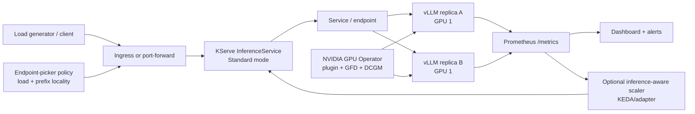
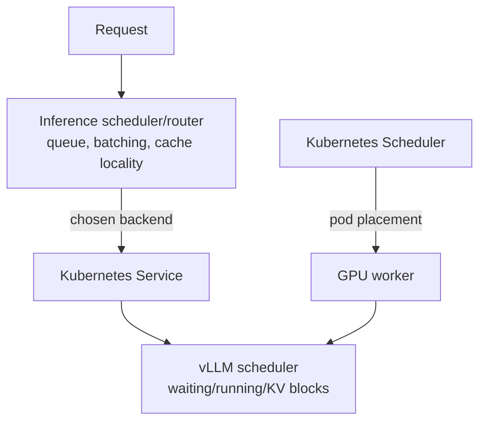

# Lab 02 — Kubernetes, GPU, KServe, Autoscaling và Observability

> **Advanced Track (optional).** Lab này không phải prerequisite cho Core
> single-node path hoặc Final Lab. Giữ nguyên artifact để học distributed LLM
> systems khi đã có cluster phù hợp; xem [Advanced Track](../ADVANCED_TRACK.md).

Lab này đưa workload vLLM của Lab 1 vào Kubernetes theo hướng có thể kiểm tra được. Profile mặc định đã hạ theo máy hiện tại: **RTX 3050 Laptop 4GB**, `Qwen/Qwen2.5-0.5B-Instruct`, một GPU cho một replica, context 4096, GPU meTrack 3 mory target 0.80.

## Kết luận về khả năng chạy trên máy hiện tại

Máy 4GB không phải là Kubernetes GPU cluster. Nó đủ để phát triển/kiểm tra manifest và có thể chạy một vLLM container đơn nếu Docker/NVIDIA runtime hoạt động, nhưng không đủ để chứng minh multi-replica, GPU-aware autoscaling, cold start trên nhiều node, routing giữa replicas hoặc failure recovery của cluster.

Vì vậy lab có hai chế độ:

| Chế độ | Có thể kết luận | Không được kết luận |
|---|---|---|
| Manifest-only, mặc định trên laptop | YAML/schema/static checks, PromQL design, load-generator logic, scheduling analysis | GPU throughput, TTFT/E2E thực tế, autoscaling event, GPU utilization |
| Cluster run | Các chỉ số có raw evidence và timestamp | Không suy rộng từ một cluster nhỏ sang production |

`ENVIRONMENT.md` ghi rõ ranh giới bằng chứng. Không điền số mẫu vào report như thể đó là số đo.

## Mục tiêu học

1. Hiểu Kubernetes Scheduler và GPU device plugin cấp `nvidia.com/gpu`.
2. Dùng NVIDIA GPU Operator để quản lý driver/toolkit/device plugin/DCGM trên GPU worker.
3. Dùng KServe Standard mode để quản lý lifecycle của `InferenceService`.
4. Chạy vLLM OpenAI-compatible streaming endpoint với resource request/limit, startup/readiness và metrics endpoint.
5. Thu thập vLLM metrics bằng Prometheus/ServiceMonitor.
6. Đo tải theo concurrency, TTFT, E2E, queue và trạng thái lỗi.
7. Phân biệt autoscaling generic (CPU/resource) và inference-aware (concurrency/queue/TTFT/KV).
8. Phân tích cold start, cache-aware routing, failure recovery, SLO, goodput, security và cost.

## Kiến trúc



### Kubernetes Scheduler và Inference Scheduler



- Kubernetes Scheduler quyết định **pod** chạy ở node nào dựa trên resource và constraint.
- Inference scheduler/router quyết định **request** đi vào replica/backend nào.
- vLLM scheduler quyết định thứ tự prefill/decode trong một engine.
- GPU utilization cao không tự chứng minh latency hay goodput tốt; phải xem queue, TTFT/E2E, error rate và SLO.

## Cấu trúc artifact

```text
lab02-kubernetes-llm/
├── README.md
├── ENVIRONMENT.md
├── VERSIONS.md
├── scripts/
│   ├── preflight.sh
│   ├── install_gpu_operator.sh
│   ├── install_monitoring.sh
│   ├── install_kserve.sh
│   ├── deploy_model.sh
│   ├── run_load_test.sh
│   └── cleanup.sh
├── manifests/
│   ├── namespace.yaml
│   ├── rbac.yaml
│   ├── inference-service.yaml
│   ├── service-monitor.yaml
│   ├── autoscaling.yaml
│   ├── endpoint-picker-config.yaml
│   ├── pod-disruption-budget.yaml
│   └── network-policy.yaml
├── monitoring/
│   ├── prometheus_queries.md
│   ├── alerts.yaml
│   └── dashboard_spec.md
├── benchmark/
│   ├── load_generator.py
│   ├── analyze_scaling.py
│   └── workload.jsonl
├── tests/
│   ├── test_health.sh
│   ├── test_gpu_assignment.sh
│   └── test_failure_recovery.sh
└── report/
    └── lab_report_template.md
```

## Chuẩn bị

### Manifest-only trên Windows/laptop

Không cần cài GPU Operator/KServe nếu chưa có cluster. Có thể kiểm tra:

```powershell
kubectl version --client
python benchmark/load_generator.py --help
python benchmark/analyze_scaling.py --help
```

Static checks không sinh ra số đo GPU. Khi chưa có cluster, report phải để `NOT_RUN`/`UNAVAILABLE`.

### Cluster run

Primary path yêu cầu Linux GPU worker, Kubernetes, Helm, `kubectl`, NVIDIA driver và container runtime. Cần cert-manager cho KServe Standard mode. Hai GPU worker được khuyến nghị cho replica/failure experiment, nhưng 1 GPU worker vẫn đủ cho baseline single replica.

```bash
cd lab02-kubernetes-llm
export KUBE_CONTEXT="<context-co-kubernetes-gpu>"
bash scripts/preflight.sh
```

Các script cài đặt có thể tạo namespace/CRD/operator; không chạy trên production cluster nếu chưa review RBAC, network policy, storage, quota và ownership.

## Cài stack theo thứ tự

```bash
bash scripts/install_gpu_operator.sh
bash scripts/install_monitoring.sh
bash scripts/install_kserve.sh
bash scripts/deploy_model.sh
bash tests/test_health.sh
bash tests/test_gpu_assignment.sh
```

`install_gpu_operator.sh` mặc định dùng driver đã cài trên node (`DRIVER_MODE=preinstalled`) để không tự động thay driver laptop. Với GPU cluster không có driver, đọc lại NVIDIA Operator docs và chạy `DRIVER_MODE=operator` trên node đã được chuẩn bị.

`install_monitoring.sh` cài kube-prometheus-stack. KEDA là optional và chỉ bật bằng `INSTALL_KEDA=1`; KServe native scaling là đường mặc định.

## Baseline vLLM/KServe cho 4GB VRAM

Manifest dùng:

```text
model: Qwen/Qwen2.5-0.5B-Instruct
image: vllm/vllm-openai:v0.8.3
max-model-len: 4096
gpu-memory-utilization: 0.80
cpu-offload-gb: 1
GPU per pod: 1
```

`cpu-offload-gb=1` là extension có thể giúp giảm áp lực VRAM nhưng làm tăng phụ thuộc CPU/PCIe và không phải cam kết OOM-proof. Nếu pod OOM: giảm `MAX_MODEL_LEN`/`--max-tokens` trước; không chuyển thẳng sang model 7B trên 4GB.

Manifest bật prefix caching có kiểm soát bằng `--enable-prefix-caching`. Prefix cache chỉ là tối ưu locality; không được kết luận là tốt nếu chưa có hit counter và TTFT comparison trên workload lặp.

KServe `InferenceService` dùng `serving.kserve.io/v1beta1`, annotation Standard mode, custom vLLM container và `minReplicas/maxReplicas`. Nếu môi trường yêu cầu `ServingRuntime` riêng hoặc schema khác, dùng `kubectl explain inferenceservice.spec.predictor` và version manifest trước khi sửa.

## Request/load test

```bash
bash scripts/run_load_test.sh --concurrency 1 --requests 5
bash scripts/run_load_test.sh --concurrency 2 --requests 10
bash scripts/run_load_test.sh --concurrency 4 --requests 20
```

Máy 4GB không nên mặc định chạy 8/16 concurrency. Chỉ tăng khi queue và KV còn headroom, và phải lưu raw CSV cho từng điều kiện. Ví dụ gọi trực tiếp:

```bash
python benchmark/load_generator.py \
  --url http://127.0.0.1:8080/v1/chat/completions \
  --model Qwen/Qwen2.5-0.5B-Instruct \
  --input-file benchmark/workload.jsonl \
  --concurrency 2 \
  --requests 10 \
  --max-tokens 64 \
  --output results/c2.csv
```

CSV phải có `request_id`, `backend`, `ttft_s`, `e2e_latency_s`, `status`, `prompt_tokens`, `completion_tokens`, `http_status`. Nếu server không trả usage hoặc không xác định replica, giá trị phải là `NA`, không được đoán.

## Metrics và PromQL

Đọc [monitoring/prometheus_queries.md](monitoring/prometheus_queries.md) trước khi chạy query. vLLM metric names thay đổi theo image/version; query rỗng là tín hiệu cần kiểm tra `/metrics`, không phải bằng chứng hệ thống không có queue.

Các nhóm bắt buộc:

- user experience: TTFT p50/p95/p99, E2E p95, error rate;
- scheduler: `running`, `waiting`, queue time;
- cache: KV usage, prefix cache hit/queries;
- infrastructure: GPU memory/utilization từ DCGM nếu exporter đang scrape;
- scaling: ready replicas, restart, scale event, cold start.

## Saturation và SLO/goodput

Bảng report bắt buộc:

| Concurrency | Req/s | TTFT p95 | Queue p95 | Waiting | KV util | SLO pass |
|---:|---:|---:|---:|---:|---:|---|
| 1 | NOT_RUN | NOT_RUN | NOT_RUN | NOT_RUN | NOT_RUN | NOT_RUN |
| 2 | NOT_RUN | NOT_RUN | NOT_RUN | NOT_RUN | NOT_RUN | NOT_RUN |
| 4 | NOT_RUN | NOT_RUN | NOT_RUN | NOT_RUN | NOT_RUN | NOT_RUN |

Saturation nên được lập luận theo chuỗi `demand tăng → running tăng → queue tăng → TTFT p95 tăng`, không dùng GPU utilization làm chỉ báo duy nhất.

SLO `X`, `Y`, `Z` phải do người làm lab chọn và giải thích theo workload; template không gọi chúng là chuẩn ngành. Goodput:

```text
goodput = số request hoàn thành và đạt SLO / thời gian quan sát
```

## Autoscaling

### Generic signal

CPU/resource-based scaling dễ tích hợp nhưng có thể phản ứng chậm hoặc sai đối với GPU-bound inference.

### Inference-aware signal

KServe native scaling trong manifest dùng concurrency làm signal nền. Queue depth, running requests, TTFT-derived metric và KV pressure được định nghĩa trong PromQL/alert. KEDA `ScaledObject` chỉ là đường optional vì nó cần target Deployment ổn định và Prometheus endpoint/auth đúng.

Traffic experiment:

```text
Idle → Low → Burst → Sustained high → Low
```

Thu timeline: scale event → pod created → scheduled → container running → readiness → first successful inference. Cold start phải tách scheduling, image pull, GPU allocation, model load, initialization, warmup và cold cache.

## Cache-aware routing

`endpoint-picker-config.yaml` là **policy input** chứ không tự cài Gateway API/Inference Extension. Policy xếp điểm theo:

```text
score = cache_locality_weight * prefix_hit_estimate
      - queue_weight * normalized_queue
      - load_weight * normalized_running
```

Không đuổi theo cache hit vô hạn: một prefix nóng có thể tạo hotspot. Với từ hai replicas, chạy Prefix A, Prefix B và random control; nếu chỉ có một replica thì ghi rõ là routing simulation/analysis, không gọi là experiment trên backend thật.

## Failure recovery

```bash
CONFIRM_FAILURE_TEST=YES bash tests/test_failure_recovery.sh
```

Chỉ chạy trên lab cluster. Không chạy delete/cordon/drain trên production. Thu failed requests, retry, reschedule, recovery time, capacity loss và SLO impact. Recovery test không đồng nghĩa với HA production nếu cluster chỉ có một GPU worker.

## Security/cost gate

- Namespace có labels audit/warn Pod Security.
- ServiceAccount không tự động mount token.
- Không hard-code HF token; model mặc định là public. Gated model phải dùng Secret ngoài repo.
- NetworkPolicy giới hạn ingress cùng namespace/monitoring và egress DNS/HTTPS cần thiết.
- Image được pin tag; production cần digest/signature scan.
- `nvidia.com/gpu` là allocation boundary, không phải application authorization.
- Bảng cost phải dùng GPU count, goodput, SLO pass, relative cost; không tự gán cloud price khi chưa có provider/region.

## Checklist production-readiness

| Gate | Evidence cần có | Trạng thái mặc định trên laptop |
|---|---|---|
| Capacity | saturation table + headroom khi mất pod | `NOT_RUN` |
| SLO | TTFT/E2E/error thresholds | definition only |
| Availability | recovery test + replica capacity | `NOT_RUN` |
| Scaling | signal + cold-start timeline | `NOT_RUN` |
| Cache | hit/queries + locality comparison | `NOT_RUN` |
| Security | RBAC, Secret, NetworkPolicy, image pin | static review |
| Observability | ServiceMonitor, queries, alerts, dashboard | static review |
| Cost | goodput/cost table | `NOT_RUN` |

## Troubleshooting nhanh

| Symptom | Kiểm tra | Hướng xử lý |
|---|---|---|
| Pod `Pending` vì GPU | `kubectl describe pod`, `kubectl describe node` | Có `nvidia.com/gpu` allocatable chưa; node selector/taint/quota có đúng không |
| Không có `nvidia.com/gpu` | device plugin/operator pods | Kiểm tra driver, runtime, GPU Operator và node OS |
| GPU Operator unhealthy | `kubectl get pods -n gpu-operator`, operator logs | So version driver/runtime/containerd với platform support |
| `ImagePullBackOff` | pod events, registry access | Pin image hợp lệ; kiểm tra egress/credentials; không đổi sang `latest` |
| OOM | vLLM log, KV metric, max context | hạ context/concurrency/max tokens; cân nhắc tắt offload nếu latency xấu |
| Startup probe fail | `kubectl describe pod`, thời gian model load | Tăng `failureThreshold/periodSeconds`; không rút probe để che cold start |
| KServe CRD mismatch | `kubectl explain inferenceservice`, CRD version | Cài đúng KServe version; không trộn ví dụ API cũ |
| ServiceMonitor không scrape | Service labels/ports, Prometheus targets | kiểm tra selector, port name, `serviceMonitorSelector` |
| PromQL empty | `/metrics`, target labels, exact metric name | dùng metric thực tế của image; ghi version/metric mapping |
| Autoscaler không scale | KServe status, signal, min/max, events | phân biệt native scaling với KEDA; xác nhận signal trả scalar/vector hợp lệ |
| Cache lạnh | prefix hit/queries, restart/replica | reset baseline, warmup riêng, không trộn cache state giữa điều kiện |
| Load timeout | client timeout, queue, server logs | giảm concurrency/max tokens, tăng timeout có lý do, lưu lỗi raw |

## Rubric và checkpoints

| Nhóm | Điểm |
|---|---:|
| Cluster/GPU | 15 |
| Serving/KServe | 15 |
| Metrics/Prometheus | 15 |
| Load test | 10 |
| Autoscaling | 15 |
| Routing/cache | 10 |
| Failure recovery | 10 |
| Security/cost/SLO | 5 |
| Report | 5 |
| **Tổng** | **100** |

- Checkpoint A: version manifest + preflight evidence.
- Checkpoint B: KServe resource Ready + GPU allocation.
- Checkpoint C: metrics scrape + query evidence.
- Checkpoint D: load/saturation table + raw CSV.
- Checkpoint E: autoscaling/cold-start/recovery hoặc ghi `NOT_RUN` có lý do.
- Checkpoint F: report anti-conclusion và production gate.

## Sources checked

| Source | Dùng cho | Ngày kiểm tra |
|---|---|---|
| [Kubernetes releases](https://kubernetes.io/releases/) | active branches/release policy | 2026-09-06 |
| [NVIDIA GPU Operator latest docs](https://docs.nvidia.com/datacenter/cloud-native/gpu-operator/latest/) | operator components | 2026-09-06 |
| [NVIDIA GPU Operator platform support](https://docs.nvidia.com/datacenter/cloud-native/gpu-operator/latest/platform-support.html) | platform/runtime compatibility | 2026-09-06 |
| [KServe installation v0.20](https://kserve.github.io/website/docs/install/kserve-install) | Standard mode, Helm/CRD install | 2026-09-06 |
| [KServe CRD API](https://kserve.github.io/website/docs/reference/crd-api) | `serving.kserve.io/v1beta1` | 2026-09-06 |
| [KServe configuration](https://kserve.github.io/website/docs/admin-guide/configurations) | Standard deployment annotation | 2026-09-06 |
| [Prometheus Community Helm charts](https://github.com/prometheus-community/helm-charts) | kube-prometheus-stack pin | 2026-09-06 |
| [KEDA Prometheus scaler](https://keda.sh/docs/2.19/scalers/prometheus/) | optional queue/PromQL scaler | 2026-09-06 |
| [vLLM v0.8.3 production metrics](https://docs.vllm.ai/en/v0.8.3/serving/metrics.html) | exact scheduler/TTFT/E2E/KV metric names | 2026-09-06 |
| [cert-manager installation](https://cert-manager.io/docs/installation/) | webhook dependency for KServe Standard mode | 2026-09-06 |

## Anti-conclusion

- Không kết luận GPU utilization càng cao càng tốt.
- Không kết luận nhiều replica luôn giảm TTFT; cache cold/startup và scheduling có thể làm tail latency xấu hơn.
- Không gọi manifest render là benchmark.
- Không gọi sample metrics là measured output.
- Không gọi một pod restart thành HA proof.
- Không coi KServe/GPU Operator là thay thế cho authorization, secret management, rate limiting hoặc audit.
