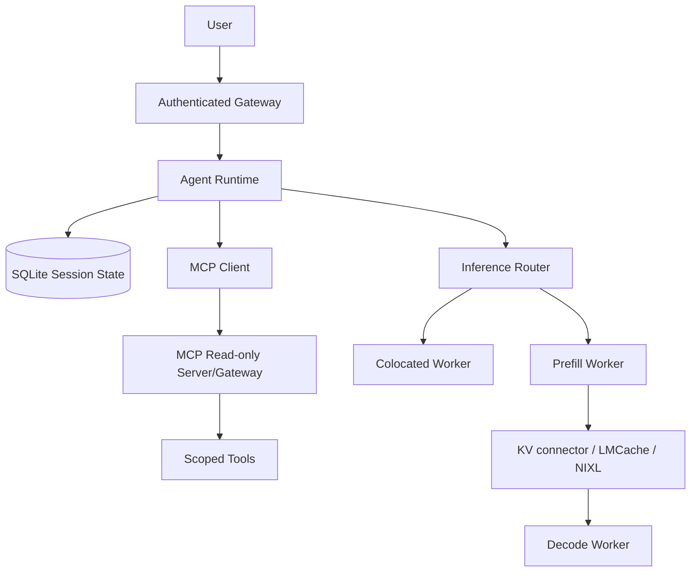

# LAB 03 — Advanced LLM Production: LMCache, P/D Disaggregation và Agent Runtime/MCP

Lab này nối ba lớp hệ thống:



Mục tiêu của lab không phải bật thật nhiều tính năng. Mục tiêu là chứng minh
được, bằng workload và raw evidence, khi nào lợi ích của specialization hoặc
cache lớn hơn transfer overhead, failure path và complexity.

## 1. Phạm vi phần cứng hiện tại

Profile đã được hạ theo môi trường của máy hiện tại:

| Thành phần | Giá trị / quyết định |
|---|---|
| GPU đã quan sát | NVIDIA GeForce RTX 3050 Laptop GPU, 4 GB VRAM |
| Model local mặc định | `Qwen/Qwen2.5-0.5B-Instruct` |
| Colocated local | Cho phép smoke test theo profile Lab 1: vLLM image `v0.8.3`, `max_model_len=2048`, GPU utilization `0.72`, một sequence |
| P/D thật | `NOT_RUN`: cần Linux + 2 GPU tương thích; RTX 3050 đơn không đủ |
| LMCache/NIXL thật | `NOT_RUN` trên profile này; chỉ giữ cấu hình tham chiếu có version và gate |
| Kubernetes | Manifest/schema review; không coi là deploy khi API server không reachable |
| Docker | Chỉ gọi là inference benchmark sau khi daemon, container, model API và GPU evidence đều có |

Không được lấy số liệu colocated trên RTX 3050 để suy ra hiệu năng P/D, RDMA,
NVLink, hai GPU hoặc production topology. Localhost/TCP và single-node chỉ
kiểm tra được kiến trúc, handoff, metric và failure path ở mức lab.

## 2. Version contract và provenance

Ngày snapshot của lab: `2026-09-06`, timezone `Asia/Bangkok`.

| Thành phần | Pin / profile | Ghi chú |
|---|---|---|
| vLLM local colocated | `vllm/vllm-openai:v0.8.3` | Kế thừa profile đã phù hợp với RTX 3050 ở Lab 1; chỉ dùng cho baseline local |
| vLLM P/D reference | `0.23.0` | Version-sensitive; cần kiểm tra lại image và compatibility matrix trước khi chạy |
| LMCache | `0.5.4` | MP mode là đường tham chiếu; package Linux/NVIDIA |
| NIXL | `1.4.0` | Optional; backend/topology phải được kiểm tra, không mặc định có UCX |
| MCP TypeScript SDK | `@modelcontextprotocol/sdk@1.30.0` | Chọn v1 stable line để khớp API `McpServer` + stdio |
| Node.js | `>=20` | Theo SDK package contract |
| Python | `>=3.10`; P/D reference nên dùng 3.12 | Router/agent/benchmark trong lab dùng stdlib |

Tài liệu chính thức đã dùng để khóa contract:

- [vLLM disaggregated prefilling](https://docs.vllm.ai/en/latest/features/disagg_prefill/)
- [LMCache quickstart và MP connector](https://docs.lmcache.ai/getting_started/quickstart.html)
- [NVIDIA NIXL releases](https://github.com/ai-dynamo/nixl/releases)
- [MCP specification authorization](https://modelcontextprotocol.io/specification/2025-06-18/basic/authorization)
- [MCP TypeScript SDK v1 server/stdio](https://ts.sdk.modelcontextprotocol.io/server)

Các command có `v0.23.0`, `LMCacheMPConnector`, `NixlConnector`, `UCX` hoặc
SDK API là **version-sensitive**. Mỗi lần đổi version phải cập nhật pin,
chạy type/schema checks, chụp `--help`/version và ghi vào report.

## 3. Cách chạy an toàn trên Windows hiện tại

PowerShell static checks:

```powershell
$root = (Resolve-Path .).Path
python -m py_compile (Get-ChildItem -Recurse -Filter *.py lab03-advanced-llm-agent | % FullName)
python -c "import yaml, pathlib; [yaml.safe_load(p.read_text(encoding='utf-8')) for p in pathlib.Path('lab03-advanced-llm-agent').glob('configs/*.yaml')]; print('YAML OK')"
python lab03-advanced-llm-agent/benchmark/benchmark_pd.py --mode design
python lab03-advanced-llm-agent/benchmark/analyze_results.py
python lab03-advanced-llm-agent/agent/agent_runtime.py --task "check model health" --mock-mcp
```

Các lệnh `.sh` cần Linux/WSL/Git Bash hoạt động. Trên thiết bị hiện tại,
WSL/bash và Docker daemon đã không được xác nhận hoạt động, vì vậy không gọi
đó là lỗi model hay benchmark. Không chạy `start_prefill.sh` hoặc
`inject_failure.sh` bằng cách bỏ qua gate.

## 4. Colocated baseline

Colocated là baseline bắt buộc trước P/D:

```text
Request -> one worker -> Prefill -> Decode -> Response
```

Chạy khi Docker daemon và GPU container runtime đã sẵn sàng:

```bash
export LAB03_EXECUTE_LINUX=yes
./lab03-advanced-llm-agent/scripts/preflight.sh
./lab03-advanced-llm-agent/scripts/start_colocated.sh
python lab03-advanced-llm-agent/benchmark/benchmark_pd.py --mode live
```

Workload cố định giữa các mode: short/short, long/short, short/long,
long/long và mixed. Giữ nguyên model, prompt, output length, request count và
concurrency khi so sánh. Ghi `TTFT`, `TPOT/ITL`, `E2E`, requests/s, tokens/s,
queue, KV usage và GPU utilization nếu backend thực sự xuất các metric.

`benchmark/common.py` đặt `token_metric_status=api_usage` chỉ khi response có
usage; nếu không là `unavailable`, không tự token-count bằng một tokenizer khác.

## 5. Multi-tier KV và LMCache

Mô hình khái niệm:

```text
GPU VRAM -> CPU RAM / LMCache MP server -> disk/remote tier (nếu đã kiểm chứng)
```

Từng tier đổi capacity và locality lấy chi phí copy, serialization, network,
eviction và consistency. Vì vậy câu “nhiều tier luôn nhanh hơn” là sai.

`start_lmcache.sh` sử dụng MP server với các option đã có trong quickstart:
host, port, L1 size, LRU và chunk size. Hai vLLM worker tham chiếu dùng:

```json
{
  "kv_connector": "LMCacheMPConnector",
  "kv_connector_module_path": "lmcache.integration.vllm.lmcache_mp_connector",
  "kv_role": "kv_both",
  "kv_connector_extra_config": {
    "lmcache.mp.host": "127.0.0.1",
    "lmcache.mp.port": 5555
  }
}
```

Không coi `lmcache-prefill.yaml` và `lmcache-decode.yaml` là bằng chứng rằng
MP server đã chạy. Muốn kết luận cache reuse phải có raw response usage hoặc
LMCache observability log ghi hit/retrieve/store, cùng model revision, chunk
size và eviction policy.

## 6. P/D disaggregation và transfer

Luồng P/D:

```text
Client -> Router -> Prefill GPU 0 -> KV connector -> Decode GPU 1 -> stream
```

Router gửi prefill với `return_token_ids` và `do_remote_decode`, lấy
`prompt_token_ids`, sau đó gửi decode với `do_remote_prefill` và token IDs.
Đây là experimental contract của vLLM; router không tự giả lập tensor KV.

Timing decomposition:

```text
T_pd = T_route + T_prefill + T_KV_transfer + T_decode
```

`T_KV_transfer` trong router là `NA` nếu worker/connector không xuất metric.
Không suy ra nó bằng zero từ việc decode request trả về thành công.

P/D có thể giúp tách tuning TTFT và ITL, hoặc giảm tail ITL trong workload phù
hợp. Nó không mặc định cải thiện throughput; phải so với colocated cùng workload.

## 7. NIXL reference

`configs/pd-disaggregated.yaml` giữ đúng shape của current vLLM docs cho
`NixlConnector`, `kv_role=kv_both`, `kv_buffer_device=cuda` và backend `UCX`.
Đây là **reference configuration**, không phải claim UCX đã cài hoặc RTX 3050
đã hỗ trợ. Trước khi chạy Linux 2-GPU:

1. kiểm tra vLLM/NIXL compatibility matrix;
2. kiểm tra CUDA, driver, GPU topology và backend plugin;
3. kiểm tra P/D accuracy/handoff trước throughput;
4. đo localhost/TCP hoặc supported intra-host path riêng với production RDMA;
5. lưu raw logs, connector config và failure result.

## 8. Router và cache-aware routing

`router/router.py` nhận OpenAI-like `POST /v1/chat/completions`, hỗ trợ:

- `router_mode=colocated|pd`;
- request ID và worker ID;
- phase timing;
- streaming relay;
- timeout;
- cache-aware pedagogical score:
  `w_cache * cache_score - w_load * load_score`;
- failure response và tùy chọn fallback colocated.

Worker A/B prefix locality chỉ là mô hình giảng dạy trong code. Cache-aware
routing có thể tăng hit/locality nhưng cũng tạo hotspot và làm xấu fairness.
Đánh giá nó cùng queue, load skew, p95 và eviction; không gọi score này là
framework scheduler production.

## 9. Failure injection và graceful degradation

Sau khi có baseline thật, trên Linux lab mới chạy:

```bash
export LAB03_EXECUTE_LINUX=yes
./lab03-advanced-llm-agent/scripts/inject_failure.sh prefill
./lab03-advanced-llm-agent/scripts/inject_failure.sh decode
./lab03-advanced-llm-agent/scripts/inject_failure.sh lmcache
./lab03-advanced-llm-agent/scripts/inject_failure.sh transfer
```

Thu error rate, timeout, recovery time, retry count, fallback và request ID.
Không retry mù. Với transfer/cache failure, nếu decode còn khả năng recompute
thì availability có thể giữ nhưng performance degradation phải được ghi riêng.
Nếu tool/action có side effect, cần idempotency key và human approval; core MCP
lab chỉ expose read-only tools.

## 10. Agent Runtime và MCP

Agent khác một lần model invocation:

```text
Task -> Decide -> LLM -> Tool -> Observe -> Update State -> LLM -> Result
```

`agent/session_store.py` lưu durable session state, completed steps, audit
events và idempotency keys bằng SQLite. Context window chỉ là input tạm cho
một lần gọi model.

`mcp-server/src/index.ts` dùng official TypeScript SDK v1 + stdio và chỉ có:

- `get_cluster_summary`;
- `get_model_health`;
- `get_recent_metrics`.

Server không có shell, bash, arbitrary filesystem write/read, generic command
execution, `kubectl exec` hay Secrets tool. `agent_runtime.py` chỉ gọi tool
trong allowlist, ghi `task_id -> tool_call_id`, fail closed khi MCP down,
timeout, invalid argument, authorization denial hoặc duplicate idempotency key.

Stdio là transport local. Nếu mở HTTP extension trong tương lai, phải thêm
authentication trước MCP handler, authorization riêng, token audience
validation và không blind-token-passthrough. Authentication trả lời “bạn là
ai”; authorization trả lời “bạn được phép làm gì”. MCP protocol statelessness
không làm business state của agent trở nên không cần thiết.

## 11. Kubernetes/RBAC

`kubernetes/rbac.yaml` chỉ cấp `get/list/watch` trong namespace `lab03` cho
pods, services, endpoints, configmaps và deployment metadata. Không có
`cluster-admin`, wildcard, write verbs, Secrets hay pods/exec. `network-policy`
khởi đầu bằng default deny và chỉ mở DNS cùng ingress agent -> MCP theo label;
hãy kiểm tra label DNS của cluster trước khi apply.

Không dùng KServe CRD vì lab này không cần extension đó. Không tạo resource
giả để làm như đã triển khai.

## 12. Workload và kết quả phải có

| Chart / bảng | Trục hoặc nội dung | Điều kiện kết luận |
|---|---|---|
| 1 | TTFT p50/p95 theo workload shape | cùng model/prompt/concurrency |
| 2 | TPOT/ITL theo output length | có token usage hợp lệ |
| 3 | E2E p95 | raw request timestamp |
| 4 | requests/s và tokens/s | tokens phải có provenance |
| 5 | Troute/Tprefill/Tdecode/TKV | TKV chỉ measured hoặc NA |
| 6 | cache hit tokens/hit ratio | usage/log thật, không prompt similarity |
| 7 | GPU memory/KV usage | metric snapshot trước/sau |
| 8 | failure error/timeout/recovery | request ID và timeline |
| 9 | cache score/load skew | ghi rõ pedagogical model |
| 10 | agent task latency, LLM calls/task, tool errors, auth denials | correlation task/tool IDs |

`results/` chỉ nhận raw CSV, logs, environment snapshot, summary và charts do
người chạy tạo. Trạng thái hiện tại của máy này là `P/D NOT_RUN`; không có số
liệu P/D để điền vào bảng.

## 13. Production readiness gate

| Gate | Cần evidence | Status trên thiết bị hiện tại |
|---|---|---|
| Capacity | saturation, long-context, worker loss | NOT ASSESSED |
| SLO | TTFT, TPOT, errors, agent task latency | colocated chỉ khi backend chạy; P/D NOT RUN |
| P/D | transfer overhead, failure path, topology | ARCHITECTURE ONLY |
| Cache | hit ratio, eviction, compatibility/staleness | NOT ASSESSED |
| Security | AuthN, AuthZ, least privilege, audience, secret boundary | static design + RBAC |
| Agent | persistence, retry, idempotency, audit, approval | local code/static test |
| Cost | GPU-hours, RAM, network, external KV, good-request cost | NOT ASSESSED |

Không gọi lab “production ready” khi còn một trong các gate trên là
`NOT ASSESSED` mà không có risk owner, measurement plan và rollback.

## 14. Trade-off matrix

| Technique | Latency | Throughput | GPU memory | Complexity | Cost |
|---|---|---|---|---|---|
| External KV | Có thể giảm prompt recompute; thêm transfer | Workload-dependent | Giảm pressure trên GPU, tăng CPU/remote usage | Medium/High | CPU/network/storage |
| P/D | Có thể tách TTFT/ITL; thêm handoff | Không mặc định tăng | Tách pool, cần capacity ở cả hai | High | thêm worker/GPU |
| Cache-aware routing | Có thể giảm miss | Có thể lệch load/hotspot | Tăng locality | Medium | routing state |
| Off-tier cache | Tăng capacity | Copy/eviction có thể giảm | Giảm VRAM, dùng RAM/disk | Medium | RAM/disk/network |
| Agent state persistence | Không tối ưu token trực tiếp | Tăng độ tin cậy workflow | negligible so với model | Medium | storage/retention |
| MCP Gateway | Có authz/audit boundary | Thêm hop | none | Medium/High | gateway/ops |

## 15. Câu hỏi tự kiểm tra

1. Tại sao Prefill và Decode có thể tách?
2. P/D tạo overhead gì?
3. Khi nào colocated hợp lý hơn?
4. KV transfer phụ thuộc network thế nào?
5. Multi-tier cache đổi capacity lấy gì?
6. Cache-aware routing có thể tạo hotspot không?
7. Vì sao localhost không đại diện RDMA?
8. Agent state khác context window thế nào?
9. MCP giải quyết gì?
10. MCP không giải quyết gì?
11. Authentication khác Authorization?
12. Token passthrough nguy hiểm thế nào?
13. Retry Agent khác retry read-only inference?
14. Khi nào cần human approval?
15. Metric nào chứng minh P/D có lợi?
16. Tại sao `T_KV_transfer=NA` không đồng nghĩa bằng zero?
17. Vì sao prompt giống nhau không đủ chứng minh cache hit?
18. Vì sao read-only Role vẫn cần tool-level authorization?

## 16. Anti-conclusion

Không được kết luận:

- P/D luôn nhanh hơn colocated;
- external KV luôn giảm TTFT;
- prefix cache luôn giảm TPOT;
- network không quan trọng;
- MCP tự giải quyết security;
- MCP stateless nghĩa agent không cần state;
- authentication đủ cho tool authorization;
- retry mọi agent action là an toàn.

> Optimization production chỉ có giá trị khi **lợi ích đo được trên workload đại diện lớn hơn overhead và complexity mà nó đưa vào hệ thống**.
